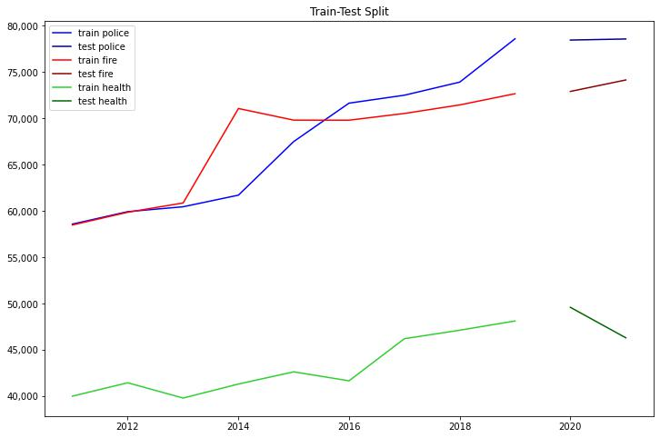

# Time Series Modeling: Baltimore City Salary Forecast

  


__________________________________________________________________________________________________________________ 

**Author:** [Nazar Mohl](https://www.linkedin.com/in/nazar-mohl/)
---  

## Background
---
Baltimore is the largest city in the state of Maryland with the largest city payroll. Maryland is a fairly prosperous state with several important industries including services to the federal sector since Washington, DC, is literally next door. Also, Maryland is prominent in the medical and pharmaceutical industries. Again, proximity to federal entities is a driver to this with NIH, NIST and other sources of federal money nearby. Baltimore hosts Social Security Administration and the Centers for Medicare and Medicaid Services which in turn has brought a lot of insurance related jobs to Maryland and Baltimore particularly.  

---  
## Business understanding  
---

Stakeholder/Business Problem:   
Our client is a recruiting company that is interested in analyzing employment possibilities in the state and local public sector. Specifically, in this project, we have been contracted to analyze employee employment/salary data in the City of Baltimore to see if salary growth can be predicted.  

---  
## Data understanding  
---

Baltimore publishes salary data at this URL:  [Baltimore City Employee Salaries](https://data.baltimorecity.gov/datasets/baltimore::baltimore-city-employee-salaries/explore?showTable=true)  
This dataset includes Baltimore City employee salaries and gross pay from fiscal year 2011 through last fiscal year and includes employees who were employed on June 30 of the last fiscal year.
(Fiscal Year is from July 1 to June 30).  
Each of the roughly 154K rows represents the salary record of one employee in one year. So an individual who continued to work from 2012 to 2015 would have 4 records in the data set - one for each year of employment.  
The record provides full name, job classification, deparment, hire date, annual salary as well as gross pay among other information. We focused on salary because it is a consistent number to go with a job classification as opposed to gross pay which may include other deductions.

---
## Data Preparation  
---
Data  was “cleaned” by removing records with null fields or filling null fields with substituted values. 
With over 63 departments in the city, we decided to focus on the 3 largest deparments concerned with public security: Police, Fire and Health deparments.  
Therefore, we sliced/diced dataset by agencies, years, job titles, etc.  
We calculated totals and means of salaries across each department for each year. We used new dataframes to hold this information and to use in our models. We charted as appropriate and as shown below.

---
## Data Analysis  
---

The following chart shows the salary totals for each department (or payroll) for every year in the dataset.
.jpg)  
Upward Payroll Trend – Except…  

Note that there is a general upward trend but there are some years where the payroll actually dropped. However, looking at the same data as a line chart below yields different insights.  

.jpg)  
Covid Impact?  

The line chart shows more clearly the year to year fluctuations of the payroll. Particularly, the last 2 years show that the rise in payrolls for the fire and police departments flattened out and even dropped. However, the health department budget, which had been fairly flat for most of the previous decade, grew more sharply.  
COuld it be that parts of the police and fire budgets were diverted to the health department due to the Covid pandemic crisis?  

In the chart below, we look at the average salary across each department and there is an unexpected observation.
.jpg) 
 Health Salaries Declined?

The average Police department salary stayed flat. The fire department whose budget had dropped actually shows the average salary increased. Conversely, the health department whose payroll had increased shows a decrease in average salary. Perhaps, this due to an influx of employees whose salary is lower than the average as a lot of technician level work was needed to handle vaccine drives, etc. The reasons for this can be investigated separately with a view to better understand the dynamics of this job market.  

---
## Modeling Process / Evaluation metrics  
---

The modeling process requires for available data to be "Train Test Split" which is to say that a large portion is allocated to "train" the model and the remaining smaller portion is allocated for testing the model. Given that there are only 11 years of annualized average salary data, we only have 11 points of time or a total of 11 values per department. 9 of these years were allocated to the training set and 2 to the test set.  
So 2011-2019 is the train set and 2020-2021 is the test set. The data train and test data for all 3 departments is depicted in the chart below.

 


The following models were applied:  
-Naive Model with Shift of 1  
-ARIMA  

Evaluation metric:  
-Root Mean Square Error (RMSE)  


### Naive Model with Shift of 1  
This Naive model essentially takes each value of the original data and shifts it by one period. So, the 2011 value becomes the 2012 value. In the simplest scenario, this model would predict that any value in time is closely equivalent to the previous value and that in general the error would be quite low.  

We applied this as a base model.

### ARIMA
We applied ARIMA model initially with 1 difference and no lags - (0,1,0). We then subsequently applied AR lag of 1 (1,1,0) and then other permutations. We used the PACF and ACF functions to determine how many lags should be applied but these functions did not recommend any lags.

---
## Model Results
---
Both the Naive Model with Shift of 1 and the ARIMA (0,1,0) models generated very close values that seemed to indicate good predictions. However, both the shift of 1 and the differencing of 1 models indicate that the prediction at any time is very close to the value at the immediately preceding time. Since the last 2 years of payroll data showed very little movement, the predictions of these models appear to be very good - a few hundred dollars different from the actual payroll value. However, this data is a Random Walk dataset and is not condusive to making a good prediction.  

---
## Conclusions  
---

With the current annualized data at the department level, the Closest prediction for any value in time is the value immediately preceding it.

However, we recommend reanalyzing the data at the job title level and even resample the data to a quarterly or monthly frequency. It may be possible that this will permit better predictability from these models.

---
## Next Steps  
---

We recommend 3 different areas in which to:  
1- Analyze job titles:
- Number of Jobs  
- Salary movements  

2- Analyze individual employees  
- Tenure in agency for each starting role  
- Career paths  

3- Analyze agency budgets  
- Evolution of number, types and ranks of jobs  
- Correlate data movements with local politics/events  

---
## Project Artifacts  
---

See our GitHub repository [here](https://github.com/NazarMohl/Baltimore_City_Salary_Forecast)  

---
### Project Structure  
---

```bash
├──.gitignore
├──Presentation.pdf
├──README.md
├──Baltimore_City_Employee_Salaries_Analysis.ipynb
├──data
   ├──Original CSV files
├──images
   ├──Charts and graphics used in README file.

```