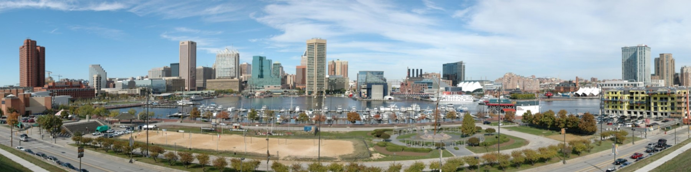

# Time Series Modeling: Baltimore_City_Salary_Forecast

  


__________________________________________________________________________________________________________________ 

**Author:** [Nazar Mohl](https://www.linkedin.com/in/nazar-mohl/)
---  

## Background
---
Baltimore is the largest city in the state of Maryland with the largest city payroll. Maryland is a fairly prosperous state with several important industries including services to the federal sector since Washington, DC, is literally next door. Also, Maryland is prominent in the medical and pharmaceutical industries. Again, proximity to federal entities is a driver to this with NIH, NIST and other sources of federal money nearby. Baltimore hosts Social Security Administration and the Centers for Medicare and Medicaid Services which in turn has brought a lot of insurance related jobs to Maryland and Baltimore particularly.  


---  
## Business understanding  
---

Stakeholder/Business Problem:   
Our client is a recruiting company that is interested in analyzing the employment possibilities in the state and local public sector. Specifically, in this project, we have been contracted to analyze employee employment/salary data in the City of Baltimore to see if salary growth can be predicted.  

---  
## Data understanding  
---

Baltimore publishes salary data at this URL:  [Baltimore City Employee Salaries](https://data.baltimorecity.gov/datasets/baltimore::baltimore-city-employee-salaries/explore?showTable=true)  
This dataset includes Baltimore City employee salaries and gross pay from fiscal year 2011 through last fiscal year and includes employees who were employed on June 30 of the last fiscal year.
(Fiscal Year is from July 1 to June 30).  

---
## Data Preparation  
---


### Record/Data Removal
Of the original


---
## Data Analysis  
---


.png)  
Upward Payroll Trend – Except…

.png)  
Covid Impact?

.png) 
 Health Salaries Declined?

---
## Modeling Process / Evaluation metrics  
---

Train Test Split
Remember that there are only 11 years or 11 points of time. 9 will be allocated to the training set and 2 to the test set.
So 2011-2019 is the train set and 2020-2021 is the test set.

 


The following models were applied:
Naive Model with Shift of 1
ARIMA

Evaluation metrics:
Root Mean Square Error (RMSE)  

---
## Model Results
---
Best Model: Naive Model with Shift of 1

Closest prediction for any value in time is the value immediately preceding it.


---
## Conclusions  
---

With current data:  
ARIMA model Not conducive in making a prediction at an annual AGENCY level

Future:  
Create model at the job title level on a monthly/quarterly basis.

---
## Next Steps  
---


We recommend 3 different areas in which to:  
1- Analyze job titles:
- Number of Jobs  
- Salary movements  

2- Analyze individual employees  
- Tenure in agency for each starting role  
- Career paths  

3- Analyze agency budgets  
- Evolution of number, types and ranks of jobs  
- Correlate data movements with local politics/events  

---
## Project Artifacts  
---

See our GitHub repository [here](https://github.com/NazarMohl/Baltimore_City_Salary_Forecast)  

---
### Project Structure  
---

```bash
├──.gitignore
├──Presentation.pdf
├──README.md
├──Baltimore_City_Employee_Salaries_Analysis.ipynb
├──data
   ├──Original CSV files
├──images
   ├──Charts and graphics used in README file.

```